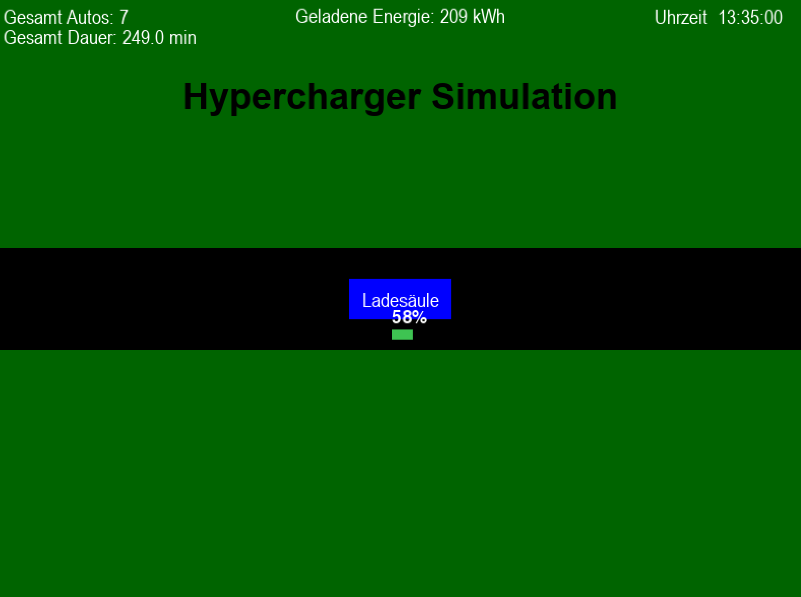

# Lebensdauerabschätzung / Nutzungsverhalten von Schnellladestationen

---

# Anforderungen
* Python 3.6 oder höher

```bash
pip install -r requirements.txt
```

# Ausführen
## Log Parser
```bash
usage: python3 log_parser.py [-h] [-f {excel,csv}] [-o OUTPUT_PATH] log_file

positional arguments:
  log_file              Path to the input Log file

options:
  -h, --help            show this help message and exit
  -f {excel,csv}, --output_format {excel,csv}
                        The format in which the output will be saved
  -o OUTPUT_PATH, --output_path OUTPUT_PATH
                        Path where the output will be saved
```

## Verteilungen berechnen
```bash
usage: python3 calculate_distributions.py [-h] excel_dataset column

positional arguments:
  excel_dataset  Path to the Excel input file
  column         Column name for which the distribution should be calculated

options:
  -h, --help     show this help message and exit
```

## Vine Copulas berechnen
```bash
usage: python3 vine_copulas.py [-h] [-f {excel,csv}] [-o OUTPUT_NAME] [-n SAMPLE_NUMBER] dataset

positional arguments:
  dataset               Path to the input file

options:
  -h, --help            show this help message and exit
  -f {excel,csv}, --input_format {excel,csv}
                        Format of the input file
  -o OUTPUT_NAME, --output_name OUTPUT_NAME
                        Name of the output model
  -n SAMPLE_NUMBER, --sample_number SAMPLE_NUMBER
                        How many samples to use from the dataset
```

## Simulation
Doppelklick auf `simulation.py` oder
```bash
python3 simulation.py
```
